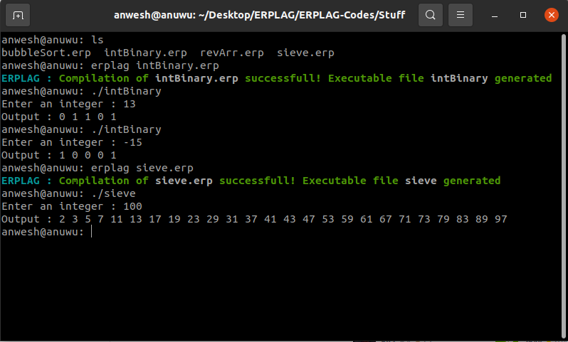

Welcome to the ERPLAG compiler. This is a toy language that was given as a semester project from the Compilers Construction course at BITS Pilani, in the year 2020.

## Unique Features
Although it's a toy language, there are features in ERPLAG which, in some sense, make it more powerful than C.
   - Abstraction of dynamic array declaration
   - Function returning multiple values

Here's a screenshot of the compiler running an ERPLAG code to compute the binary representation of a decimal number (`./intBinary`) and the Sieve of Eratosthenes (`./sieve`). These codes can be found in the associated repository [here](https://github.com/anuwu/ERPLAG-Codes).

## Pre-requisites

The dependencies on using the ERPLAG compiler are -
   - `gcc`
   - `nasm`
### For Linux/macOS

ERPLAG compiler uses **make** to build on Linux/macOS. If any dependency is missing, the installer script attempts to take care of it only if one of the following package managers are available -

   - `apt`
   - `yum`
   - `zypper`
   - `pacman`

In macOS, please ensure that **Homebrew** is installed (if not, the script attempts to install homebrew)

### For Windows
Please install the dependencies mentioned above and add them to the environment PATH variable.

## Installation
To install the compiler, clone this repository (with git or downloading the zip), open a terminal in its directory and run the install script as follows -
   - `git clone https://github.com/anwesh0304/ERPLAG-Compiler.git`
   - `cd ERPLAG-Compiler`
   - `./install` for **Linux/macOS**
   - `install` for **Windows**

### Manual Installation
If the installation fails, or you wish to do it manually, you have to complete the following steps -
   - `gcc -o .compiler erplag.c codegen.c ast.c lexer.c parser.c symbolTable.c typeChecker.c error.c`
### In Linux/macOS
   - `sudo cp .compiler /usr/local/bin`
   - `sudo cp erplag /usr/local/bin`
   - `sudo cp erpclr /usr/local/bin`
      If the above steps fail, you have to add the repository directory to the PATH variable.
### In Windows
   Inside the repository, if there does not exist a batch file named 'erplag.bat', run in command prompt -
   - `rename .erplag erplag.bat`

   Add the repository directory to the environment PATH variable.

## Info

1. Create your own erplag files using an extension of .erp.
2. Use erplag -h for help on using the compiler.
3. Information regarding the language can be found in the /Docs folder
4. The final grammar used by the compiler is written in a separate pdf in the folder
5. Additional changes to the language are explained in "notes.txt" in the /Docs folder
6. Get started on the language with some tutorial codes in the /Basics folder.

## Note
**The compiler has been built only for 64-bit operating systems, running on x86_64 architecture, and tested on the following -**
1. Linux
   - `Ubuntu/Parrot OS`
   - `openSUSE`
   - `Fedora`
   - `Manjaro`

2. Windows 7/10

**It could occur that the compiler isn't able to process the .asm files to output the executable. This is due to an incompatible version of NASM being installed by the installation script. If this occurs, please install a version of NASM that is compatible with your machine architecture. Then run `erplag -a <filename>.erp`, and do the following -**

First assemble using nasm -
   - `nasm -felf64 <filename>.asm` for **Linux**
   - `nasm -fmacho64 <filename>.asm` for **macOS**
   - `nasm -fwin64 <filename>.asm` for **Windows**

Then link with gcc -
   - `gcc -no-pie <filename>.o -o <executable>` for **Linux/macOS**
   - `gcc <filename>.obj -o <executable>.exe` for **Windows**

## Uninstallation
To uninstall, open a terminal in the repository and execute -
   - `./uninstall` for **Linux/macOS**
   - `uninstall`for **Windows**

Additionally, ensure to remove the repository from the environment PATH in **Windows**.

No need to do this step for **Linux/macOS** unless you have installed it manually and added to path.
